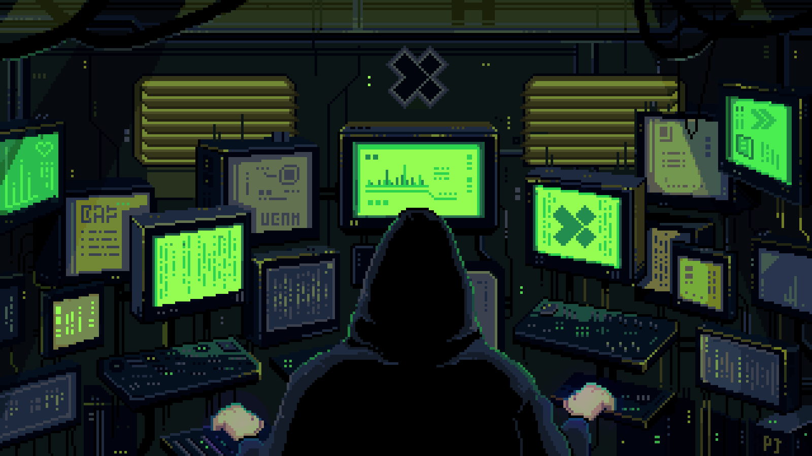

# 🚀 Horual Leon | Senior Software Developer 

  

Hi there! I'm Horual Leon, a passionate software developer with deep roots in mainframe systems and COBOL, but an ever-growing enthusiasm for modern mobile and web technologies.

💼 Senior Developer with 28+ years of experience in banking, government, and enterprise systems  
💾 Mainframe wizard: COBOL, JCL, DB2, CICS   
📱 Tech explorer: Building the BORA app – an event search and ticketing platform powered by React Native, Node.js, and PostgreSQL   
🚀 Always learning and evolving with new stacks like Next.js and TypeScript   
🇧🇷 Based in Brazil, open to global opportunities   
"Legacy systems taught me stability. Modern tech teaches me speed. I build with both."
      

#

<h3 align="left">Connect with me!</h3>

<h3 align="left">My Stack ~</h3>

  
  
  
  
   
  
  
  
  
  
  
  
  
  
  
  
  

#

  <h3>* GitHub Stats *</h3>
  
  

  
  
  

###

<picture align="center">
  <source media="(prefers-color-scheme: dark)" srcset="https://raw.githubusercontent.com/Horual/Horual/output/github-contribution-grid-snake-dark.svg">
  <source media="(prefers-color-scheme: light)" srcset="https://raw.githubusercontent.com/Horual/Horual/output/github-contribution-grid-snake-dark.svg">
  
</picture>

